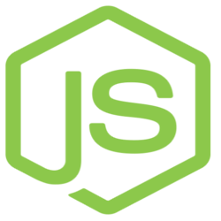

# Proffy

<h4 align="center"> 
	
</h4>
<br />
<p align="center">
 <a href="#-sobre-o-projeto">Sobre</a> •
 <a href="#-como-executar-o-projeto">Como executar</a> • 
 <a href="#-funcionalidades">Funcionalidades</a> •
 <a href="#-tecnologias">Tecnologias</a> • 
 <a href="#-autor">Autor</a> • 
 <a href="#user-content--licença">Licença</a>
</p>

## Sobre o projeto

**Proffy** - Marketplace desenvolvido para fazer à conexão entre Professores particulares e pessoas que precisam estudar sobre Matérias do Ensino Médio; Essa conexão é feita através do cadastro de Aulas por parte dos Professores, e pelos Alunos entrando em contato via Whatsapp. 

<details>
  <summary>Clique aqui para ver mais informações</summary>
  <section>
    <div>
      Este Projeto foi desenvolvido durante à <b>Next Level Week 2 (NLW)</b> um evento oferecido pela <a href="https://blog.rocketseat.com.br/">RocketSeat</a>. À <b>NLW</b> é um curso intensivo online e gratuito, com muito conteúdo prático e informativo - Com um único objetivo, levar você ao próximo nível.
    </div>
    <br />
    <div>
    O conteúdo é exibido durante <b>1 semana</b>, e em cada dia da semana, é apresentado uma etapa para o desenvolvimento do projeto, desde o <b>Back-end</b> até o <b>Front-end Web</b> e <b>Mobile</b>, utilizando as tecnologias:
    <br />
    <div style="display: flex; flex-direction: row; margin-left: 1.6rem">
      <a href="">NodeJS </a>
      <a href="">ReacJs </a>
      <a href="">React Native </a>
    </div>
    </div>  
  </section>
</details>
<br />
 <div align="center">
  <sub>Agradeço de 💜 à
    <a href="https://github.com/diego3g">Diego Fernandez</a> e toda equipe:
    <a href="https://github.com/rocketseat">Rocketseat</a>:facepunch:
  </sub>
</div>

---


## 🚀 Como executar o projeto

<details>
  <summary>Clique aqui para ver os Pré-requisitos</summary>
  <section>
    <div>
    <h2>Este projeto é divido em três partes:</h2>
    <h4>1 Back-end(pasta server)</h4> 
    <h4>2 Front-end Web (pasta web)</h4>
    <h4>3 Front-end Mobile (pasta mobile)</h4>
    <br />
    <h3>💡Tanto o Frontend quanto o Mobile precisam que o Backend esteja sendo executado para funcionar.</h3>
    </div>
  </section>
</details>

```bash

# Clone este repositório
$ git clone https://github.com/Felipe-Antoniati/proffy-v1-nlw2.git

```

#### :minidisc: Iniciar o Servidor (Back-end)

```bash

# Acesse a pasta server do projeto no terminal/powershell
$ cd proffy-v1-nlw2/server

# Instale as dependências
$ yarn install

# Execute a aplicação em modo de desenvolvimento
$ yarn dev

# O servidor inciará na porta:5000 - acesse http://localhost:5000

```

#### 💻 Iniciar Aplicação Web

```bash

# Acesse a pasta Web do projeto no terminal/powershell
$ cd proffy-v1-nlw2/client/web

# Instale as dependências
$ yarn install

# Execute a aplicação em modo de desenvolvimento
$ yarn start

# A aplicação será aberta na porta:3000 - acesse http://localhost:3000

```

#### 📱 Iniciar Aplicação Mobile

```bash
Para rodar o projeto mobile você precisa de um celular com o Expo instalado
ou um emulador android/ios.

# # Acesse a pasta Mobile do projeto no terminal/powershell
$ cd proffy-v1-nlw2/client/mobile

# Instale as depedencias
$ yarn install

# Rode a aplicação
$ yarn start

> Depois leia o QRCode com o app do Expo ou rode em um emulador.

```


---

## ⚙️ Funcionalidades

- [x] Os Professores tem acesso ao **aplicativo Web**, onde podem: 
  - [x] Cadastrar-se na plataforma enviando:
    - [x] Uma imagem para o perfil (avatar).
    - [x] Nome completo, Email e Whatsapp.
    - [x] Biografia.
  - [x] Cadastrar Aulas selecionando:
    - [x] Uma Matéria.
    - [x] Um dia da semana.
    - [x] Um horário.

- [x] Os Alunos tem acesso ao **aplicativo Mobile**, onde podem:
  - [x] Selecionar a Matéria, o dia da semana e a hora que quer estudar.
  - [x] Entrar em contato com os professores através do E-mail ou do WhatsApp.

---

## 🛠 Tecnologias

**As seguintes ferramentas foram utilizadas na construção do Projeto:**

<details>
  <summary><b>Server - <a href="https://nodejs.org/en/">NodeJS</a> + <a href="https://www.typescriptlang.org/">Typescript</a></b></summary>
  <section>
    <div style="display: flex; flex-direction: column">
     <a href="https://expressjs.com/">Express</a><br />
      <a href="https://expressjs.com/en/resources/middleware/cors.html">Cors</a><br />
      <a href="https://typeorm.io/">TypeORM</a><br />
      <a href="https://github.com/mapbox/node-sqlite3">SQLite</a><br />
      <a href="https://github.com/TypeStrong/ts-node">ts-node</a><br />
      <a href="https://github.com/jquense/yup">Yup</a><br />
      <a href="https://github.com/expressjs/multer">Multer</a><br />
      <br />
      <sub>
        <h1> Veja o arquivo package.json para mais informações.</h1>
      </sub>
    </div>
  </section>
</details>
<details>
  <summary><b>Web - <a href="https://reactjs.org">React</a> + <a href="https://www.typescriptlang.org/">Typescript</a></b></summary>
  <section>
    <div style="display: flex; flex-direction: column">
      <a href="https://github.com/ReactTraining/react-router/tree/master/packages/react-router-dom">React Router Dom</a><br />
      <a href="https://react-icons.github.io/react-icons/">React Icons</a><br />
      <a href="https://react-leaflet.js.org/en/">Leaflet Js</a><br />
      <a href="https://react-leaflet.js.org/">React Leaflet</a><br />
      <a href="https://github.com/axios/axios">Axios</a>
      <br />
      <sub>
        <h1> Veja o arquivo package.json para mais informações.</h1>
      </sub>
    </div>
  </section>
</details>
<details>
  <summary><b>Mobile - <a href="http://www.reactnative.com/">React Native</a> + <a href="https://www.typescriptlang.org/">Typescript</a></b></summary>
  <section>
    <div style="display: flex; flex-direction: column">
      <a href="https://expo.io/">Expo</a><br />
      <a href="https://docs.expo.io/versions/latest/sdk/constants/">Expo Google Fonts</a><br />
      <a href="https://docs.expo.io/versions/latest/sdk/mail-composer/">Expo Mail Composer</a><br />
      <a href="https://reactnavigation.org/">React Navigation</a><br />
      <a href="https://github.com/react-native-community/react-native-maps">React Native Maps</a><br />
      <a href="https://github.com/axios/axios">Axios</a><br />
      <br />
      <sub>
        <h1> Veja o arquivo package.json para mais informações.</h1>
      </sub>
    </div>
  </section>
</details>

## 💪 Como contribuir para o projeto

1. Faça um **fork** deste projeto.
2. Crie uma nova branch com as suas alterações: `git checkout -b my-feature`
3. Salve as alterações e crie uma mensagem de commit contando o que você fez: `git commit -m "feature: My new feature"`
4. Envie as suas alterações: `git push origin my-feature`
   > Em caso de dúvidas, confira este [guia de como contribuir no GitHub](./CONTRIBUTING.md)

---

## 👨‍💻 Dev,s que trabalharam neste Repositório

<a href="https://github.com/felipe-antoniati">
 
 <br />
 <sub><b>Felipe Antoniati</b></sub></a> <a href="https://github.com/felipe-antoniati" title="Fullstack Programmer">🚀</a>
 <br />

 [](https://www.linkedin.com/in/felipe-antoniati-1288041b7/)<br />
[](mailto:antoniati.felipe@gmail.com)

---

## 📝 Licença

Este projeto esta sobe a licença [MIT](./LICENSE).

---

## Versões do README

[Português-BR 🇧🇷](./README-ptBR.md) | [Inglês-EUA 🇺🇸](./README.md)

De uma ⭐️ neste Projeto, para liberar a dopamina!
